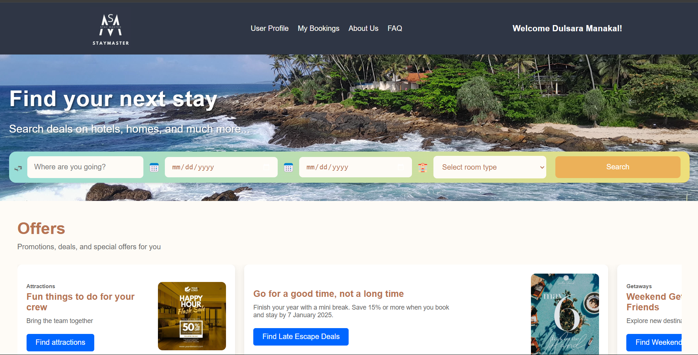
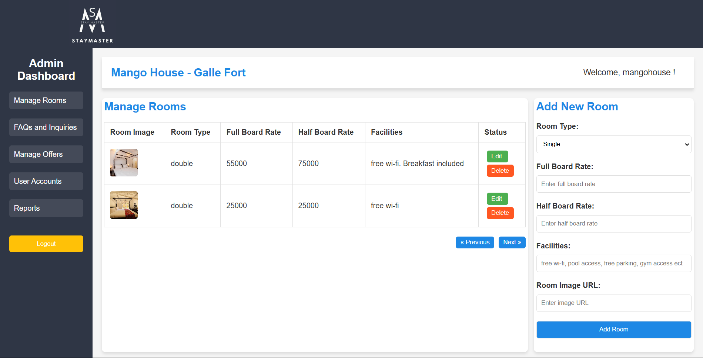

# Online Hotel Reservation System

An online hotel reservation system developed as a university group project to gain experience and knowledge in software development. This project demonstrates the use of modern technologies, including **Java**, **HTML**, **CSS**, **JavaScript**, and **MySQL**, using the **MVC architecture**. It is designed for educational purposes, not for commercial use.

---

## Features

### For Customers:
- Create an account and log in to the system.
- Search for available rooms based on:
  - Date of stay.
  - Room type.
  - Location.
- View detailed information about rooms, including images.
- Book rooms.
- Edit user profile details.
- Add payment details.

### For Hotel Managers:
- Create and log in to a hotel manager account.
- Add hotels and their rooms to the system.
- Update room details.
- Delete rooms as necessary.
- Manage hotel data.

---

## Technologies Used

- **Frontend**: HTML, CSS, JavaScript
- **Backend**: Java, JSP
- **Database**: MySQL (MySQL Workbench)
- **Server**: Apache Tomcat (version 8)
- **Architecture**: Model-View-Controller (MVC)
- **Environment**: Eclipse IDE

---

## Installation and Setup

To set up and run the Online Hotel Reservation System locally, follow these steps:

1. **Clone the Repository**:
   ```bash
   git clone <repository-url>
   ```
   
2. **Import the Project into Eclipse**:
   - Open **Eclipse IDE**.
   - Go to `File > Import > Existing Projects into Workspace`.
   - Select the cloned repository folder.

3. **Set Up Apache Tomcat**:
   - Download and install **Apache Tomcat version 8**.
   - Configure Tomcat in Eclipse:
     - Go to `Window > Preferences > Server > Runtime Environments`.
     - Add Apache Tomcat (version 8) and specify its installation directory.

4. **Set Up the Database**:
   - Install **MySQL** and open **MySQL Workbench**.
   - Create a new database for the project.
   - Import the provided SQL schema and data files (usually found in the `database` or `sql` folder of the project).
   - Update the database connection settings in the project's configuration file (e.g., `db.properties` or similar).

5. **Run the Project**:
   - Right-click on the project in Eclipse.
   - Select `Run As > Run on Server`.
   - Choose Apache Tomcat as the server and start the application.

6. **Access the Application**:
   - Open your web browser and navigate to `http://localhost:8080/<project-name>`.

---

## Contributing

We welcome contributions to improve this project. Please follow these guidelines:

1. **Fork the Repository**:
   - Click on the "Fork" button at the top of the repository page.

2. **Clone the Fork**:
   ```bash
   git clone <fork-url>
   ```

3. **Create a Branch**:
   ```bash
   git checkout -b feature/your-feature-name
   ```

4. **Make Your Changes**:
   - Add your feature or fix issues.

5. **Push and Create a Pull Request**:
   ```bash
   git push origin feature/your-feature-name
   ```
   - Go to the original repository and submit a pull request.

---

## Screenshots

### Customer Dashboard:


### Hotel Manager Dashboard:


## License

This project is not licensed.

## Contact  
For any inquiries or contributions, reach out to:  
**Email**: dulsaramanakal@gmail.com
**Email**: ranaweerahimaya052@gmail.com
**Email**: kavindyaliyanaarachchi25@gmail.com
